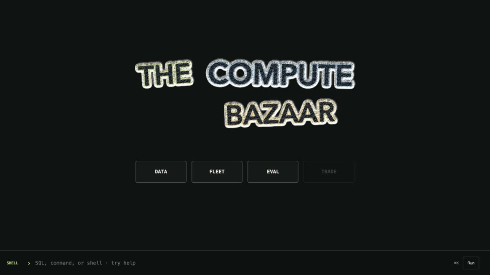
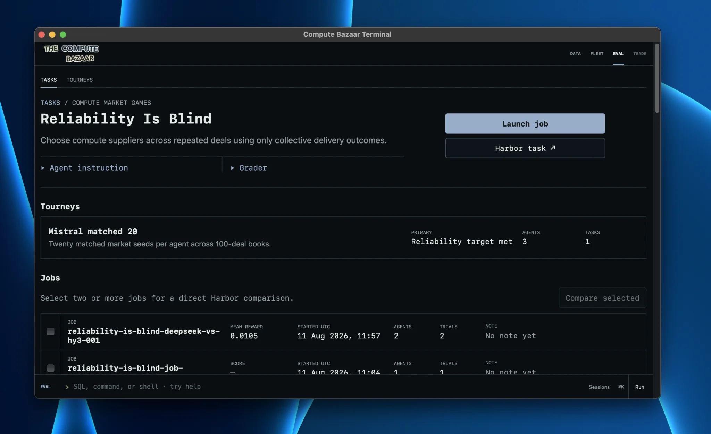
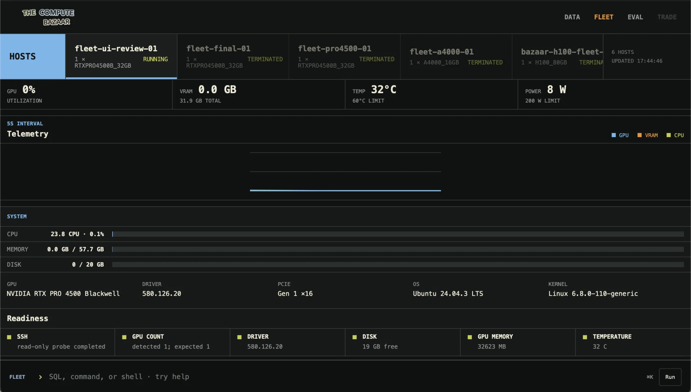

<p align="center">
  <br>
  <strong>The Compute Bazaar</strong><br>
  <a href="#terminal">Terminal</a> • <a href="#data">Data</a> • <a href="#eval">Eval</a> • <a href="#fleet">Fleet</a> • Trade
</p>

My vision is to build The Compute Bazaar as much for humans as for
machine-to-machine work.

## Architecture

I use Windmill to orchestrate the hourly data pipeline. It runs ingestion every
hour and publishes the live data through AutoMQ, a Kafka-compatible event
stream. I use S3 for storage: a Bronze layer for raw data, a Silver layer for
normalized data ready for analysis, and Gold models for things such as GPU price
indexes and availability.

This data can be queried with DataFusion, an SQL query engine built on Apache
Arrow. Perspective also accepts Arrow data, so I am currently exploring it to
visualize the query results. All of this can be used through the CLI and
Terminal.

Hourly reads, direct provider reads, and the final check before a rental use the
same offer-observation columns. Scheduled rows live in S3; direct reads, launch
checks, and Fleet measurements stay private and local. DataFusion presents them
as one catalog, so we can follow the market record into a selected offer and the
machine that arrived without putting direct reads into the hourly index.

The idea behind the lake being object storage is that agents can use SQL for
analysis or inspect the underlying files directly, such as contracts, deals, or
whatever else needs source evidence. This matters because compute markets are
not just quantitative, but qualitative too.

More detail: [Architecture](docs/architecture.md).

## Setup

Install the project and sync the hourly updated public market lake.

```bash
curl -fsSL https://raw.githubusercontent.com/gustofied/the-compute-bazaar/main/install.sh | sh
export PATH="$HOME/.local/bin:$PATH"
compute-bazaar terminal
```

For development, clone the repository directly.

```bash
git clone https://github.com/gustofied/the-compute-bazaar.git
cd the-compute-bazaar
uv sync
source .venv/bin/activate
compute-bazaar data sync
compute-bazaar data status
compute-bazaar price-index
```

`data sync` downloads the latest public Silver and Gold tables. Run it again
for the newest hourly data; `data status` shows the current run and freshness,
while `price-index` prints one example market view.

`compute-bazaar` prints tables by default. Use
`compute-bazaar --format json COMMAND` for machine-readable output.

## Data

Start by listing the DataFusion catalog and inspecting a table.

```bash
compute-bazaar tables
compute-bazaar describe silver.offer_observations
compute-bazaar describe gold.fact_gpu_price_index
```

Run a built-in market query or write SQL directly.

```bash
compute-bazaar availability --gpu-model H100 --history --limit 20

compute-bazaar sql "
select provider, gpu_model, price_usd_gpu_hr
from silver.offer_observations
where observation_purpose = 'scheduled'
order by price_usd_gpu_hr
limit 20
"
```

`listings` reads the synced hourly record. `offers` asks RunPod and Verda what
can be selected now. Both use `silver.offer_observations`; the row says whether
it came from the hourly run or a direct provider read.

```bash
uv sync --extra providers
compute-bazaar offers list --provider runpod --gpu-model H100
compute-bazaar offers inspect OFFER_ID
```

RunPod's live catalog is public. Verda live availability uses the OAuth values
shown in `.env.example`.

## Terminal

<p align="center">
  
</p>

The Terminal is where we look at data, evaluate agents, and eventually place
trades.

Let's start with Data, and how The Compute Bazaar enables market models and
views that can be stored, reused, shared, and used by agents. It works both
ways: people can make models for agents, and agents can make models and views
for people or other agents to use later. A model can also run inside a pipeline,
for example whenever a new hourly observation arrives. The Compute Bazaar is
extensible.

```bash
uv sync --extra terminal
pnpm --dir terminal install
compute-bazaar terminal
```

The Terminal opens with Data, Fleet, Eval, and Trade. Data is where DataFusion
queries market data and [Perspective](https://perspective-dev.github.io) turns
the results into tables and charts. Eval contains agent evaluation tasks, jobs,
and trials powered by Harbor. Trade is in the works.

Data can open a saved query or custom SQL as an interactive table or chart.

```bash
compute-bazaar query gpu_price_index_history --terminal

compute-bazaar sql "
select
  gold_observed_at as observed_at,
  benchmark_family_id as gpu,
  benchmark_usd_gpu_hr as price_usd_gpu_hr
from gold.fact_gpu_price_index_history
where benchmark_family_id in ('H100', 'H200', 'B200', 'B300')
order by observed_at, gpu
" --terminal --chart line --x observed_at --series gpu --y price_usd_gpu_hr
```

A market model contains reusable DataFusion SQL. Its view describes how
Perspective displays the result. Terminal Save writes both under `analyses/`,
where they can be rerun, shared, reviewed, or used by agents.

```bash
compute-bazaar model list
compute-bazaar model run h200-under-4
compute-bazaar blueprint open h200-under-4
```

For anyone who wants to read the market, whether a quant, a broker, or someone
looking in from the outside, being able to curate your own market models and
views is useful. The Compute Bazaar gives you that: write the model, save its
view, and run it again as new data comes in.

Press `Cmd+K` inside the Terminal to run SQL, inspect tables, or move between
Data and Eval. Stop the Terminal with:

```bash
compute-bazaar terminal --stop
```

## Eval

[Compute Bazaar Bench](https://github.com/gustofied/the-compute-bazaar/tree/main/compute-bazaar-bench) is a benchmark for evaluating agents on compute-market tasks.

Tourneys compare agents across the same tasks or market seeds. They are defined
separately, so the Harbor tasks remain reusable by anyone.

<p align="center">
  <a href="https://github.com/gustofied/the-compute-bazaar/tree/main/compute-bazaar-bench"></a>
</p>

## Fleet

<p align="center">
  
</p>

Fleet operates NVIDIA nodes over SSH. A node can be provisioned from a live
offer or attached through OpenSSH. Fleet records inventory, runs readiness
checks, monitors telemetry and health every five seconds, and tracks workloads
and logs.

```text
Live offer
  -> availability check
  -> provision
  -> allocation ----+
                    |
SSH host -> attach -+-> Fleet node
                          |
                          +-> inventory
                          +-> readiness and diagnostics
                          +-> telemetry and health
                          +-> workloads and logs
```

Attach an existing node by SSH host alias. OpenSSH resolves its address, user,
key, agent, and jump host; Fleet stores only the alias.

```bash
compute-bazaar fleet attach gpu-singapore-01 --expect H100 --count 8
```

Or launch one from a live offer.

```bash
compute-bazaar offers list --provider runpod

compute-bazaar launch run OFFER_ID \
  --name HOST \
  --image runpod/pytorch:1.0.3-cu1281-torch291-ubuntu2404 \
  --max-hourly-usd 0.75 \
  --runtime-minutes 30 \
  --confirm-spend
```

Inspect it, run readiness checks, monitor it, and run workloads through the CLI
or Terminal.

```bash
compute-bazaar fleet hosts
compute-bazaar fleet inspect HOST_ID
compute-bazaar fleet doctor HOST_ID
compute-bazaar terminal
compute-bazaar fleet workload run HOST_ID --name training -- python train.py
compute-bazaar fleet workload list --host HOST_ID
compute-bazaar fleet workload logs WORKLOAD_ID
compute-bazaar fleet terminate HOST_ID --confirm
```

The DataFusion catalog keeps the market, allocation, and Fleet records together.

```bash
compute-bazaar sql "select * from silver.current_offers order by price_usd_gpu_hr"
compute-bazaar sql "select * from silver.offer_observations order by observed_at desc"
compute-bazaar sql "select * from fleet.nodes order by created_at desc"
compute-bazaar sql "select * from gold.fact_market_to_fleet"
compute-bazaar model run gpu-launch-candidates
```

`launch run` checks availability and price again before spending, then records
the offer on the allocation. Fleet keeps node inventory, five-second telemetry,
workload state, exit codes, and logs. Remote workloads continue when the
Terminal closes.

If a launch ends before RunPod confirms the result, reconcile it before trying
again.

```bash
compute-bazaar launch reconcile ATTEMPT_ID
```

### To do

- GPU PROC [Not Found] bug need to fix
- add other providers than runpod
