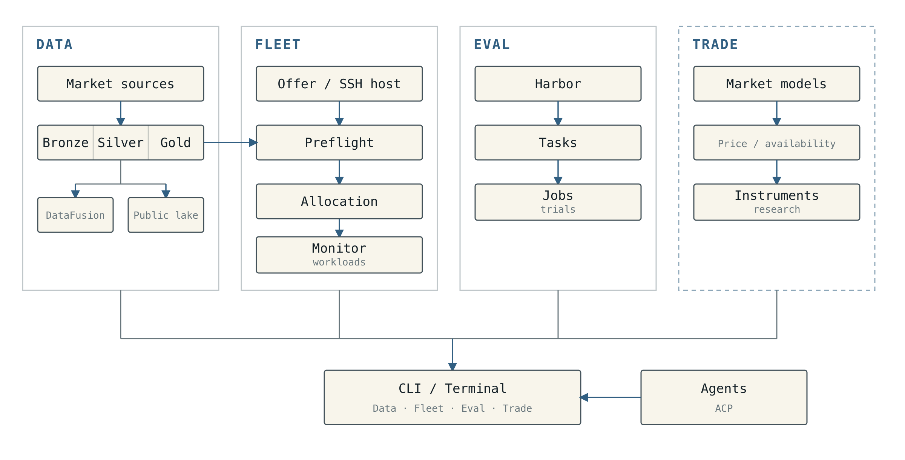
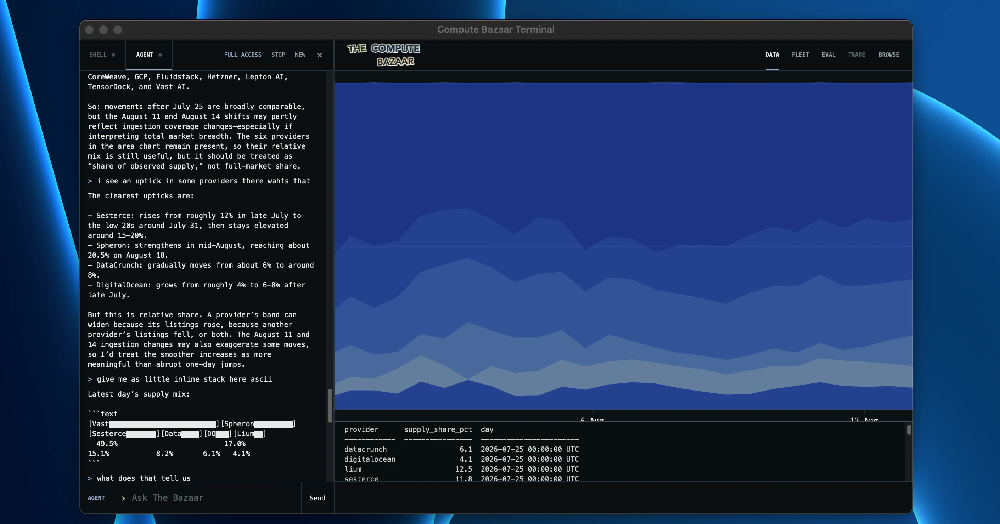
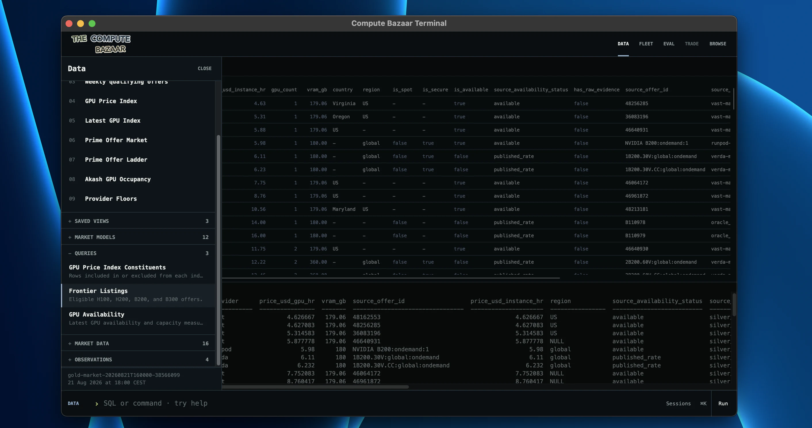
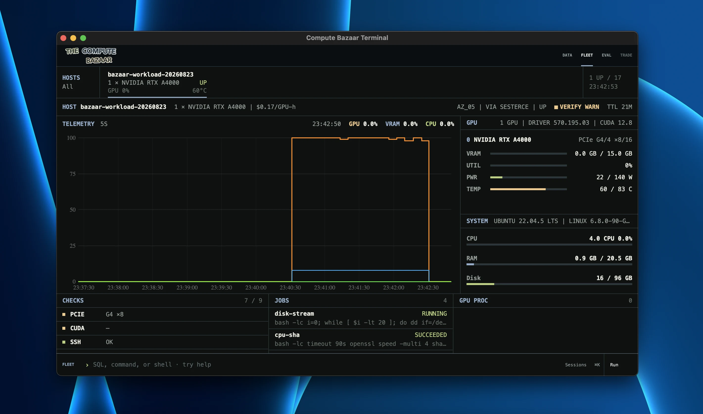

<p align="center">
  <br>
  <strong>The Compute Bazaar</strong><br>
  <a href="#terminal">Terminal</a> • <a href="#data">Data</a> • <a href="#eval">Eval</a> • <a href="#fleet">Fleet</a> • <a href="#trade">Trade</a><br><br>
  <a href="https://www.adamsioud.com/exemplars/compute/feeling_the_compute">Article</a>
</p>

With The Compute Bazaar, you sit at the compute trading desk. Use live and
historical market data to analyse the market and build your own models. Find and
rent compute, then operate and monitor it through Fleet. Through ACP, agent
harnesses such as Codex and OpenCode can work alongside you. In practice, an
agent can operate the same compute desk as you: run commands, open results, and
move between Data, Fleet, and Eval. In Eval, create and run Harbor benchmarks
for agents across compute deal work and compute market games. Finally, Trade
explores financial instruments for hedging compute price and availability risk.

The Compute Bazaar is ongoing work, continuing ideas from my earlier work on
[OUDAU](https://www.adamsioud.com/projects/oudau.html).

## Setup

Install The Compute Bazaar.

```console
$ curl -fsSL https://raw.githubusercontent.com/gustofied/the-compute-bazaar/refs/heads/main/install.sh | sh
```

Or clone the repository.

```console
$ git clone https://github.com/gustofied/the-compute-bazaar.git
$ cd the-compute-bazaar
$ ./install.sh
```

Use the CLI directly.

```console
$ compute-bazaar price-index
$ compute-bazaar availability --gpu-model H100 --limit 20
```

Or open the Terminal.

```console
$ compute-bazaar terminal
```

## Architecture

The Bazaar uses Windmill for orchestration, AutoMQ for event streaming, S3 for
storage, Parquet and Arrow, DataFusion for queries, Perspective for
dashboards/views, Tauri for the Terminal, ACP for agents, and Harbor for Eval.
Read more about the [pipeline](infra/windmill/README.md), [public
lake](infra/aws/public-feed/README.md), and [architecture](docs/architecture.md).

<p align="center">
  <picture>
    <source media="(prefers-color-scheme: dark)" srcset="assets/compute-bazaar-architecture-dark.png">
    
  </picture>
</p>

## Terminal

<p align="center">
  
</p>

The Terminal opens Data, Fleet, Eval, and Trade in one local window. It is
optional; The Bazaar can also be used directly through the `compute-bazaar`
CLI.

The side drawer keeps Shell and Agent separate. Shell is a PTY. Agent connects
through ACP and uses the same project and CLI, so Codex, OpenCode, or another
ACP agent can operate the desk alongside you.

In Data, DataFusion runs SQL and Perspective renders the result as a table or
chart. Queries and views can be saved, rerun, or opened in the running
Terminal.

```bash
compute-bazaar query gpu_price_index_history --terminal
```

Press `Cmd+K` anywhere in the Terminal to start typing a command. Stop the
Terminal with:

```bash
compute-bazaar terminal --stop
```

## Data

<p align="center">
  
</p>

The lake uses the usual Bronze, Silver, and Gold layers. Bronze stores the raw
data as it arrived. Silver cleans and standardizes it so it can be queried and
analysed. Gold contains ready-made indexes, histories, and other datasets for
analysis and visualisation. New providers and datasets follow the same route.
Bronze is JSON; Silver and Gold are Parquet.

A sanitized Silver and Gold snapshot is published to a rolling GitHub Release
for `compute-bazaar data sync`.

### Querying the lake

DataFusion is the read-only SQL engine over the selected lake. Results are
returned as Apache Arrow: the CLI prints them as tables or JSON, while the
Terminal sends the same Arrow result to Perspective.

List the catalog and inspect a table:

```bash
compute-bazaar tables
compute-bazaar describe silver.offer_observations
compute-bazaar describe gold.fact_gpu_price_index
```

Or turn a DataFusion query into a Perspective chart in the running Terminal:

```bash
compute-bazaar sql "
select
  gold_observed_at,
  benchmark_usd_gpu_hr
from gold.fact_gpu_price_index_history
where benchmark_family_id = 'H200'
  and gold_observed_at >= (
    select max(gold_observed_at) - interval '21 days'
    from gold.fact_gpu_price_index_history
  )
order by gold_observed_at
" --limit 600 --terminal --chart line \
  --x gold_observed_at --y benchmark_usd_gpu_hr
```

Use `compute-bazaar --format json COMMAND` for machine-readable output. A
compatible lake can be selected with `--lake-root` or
`COMPUTE_BAZAAR_LAKE_ROOT`.

The current Silver and Gold lake is built by the multi-provider pipeline. The
newer [`market`](src/the_compute_bazaar/market/) path is replacing it one source
at a time, starting with Sesterce; Gold still uses the existing pipeline.

### Models and views

Reusable DataFusion SQL is saved as a model. A blueprint saves a Perspective
view of that model. The model works on its own through the CLI or an agent, and
one model can have several table or chart views.

```bash
compute-bazaar model save my-model --file query.sql
compute-bazaar model run my-model
compute-bazaar blueprint save my-view --model my-model --config view.json
compute-bazaar blueprint open my-view
```

Personal models and views are stored outside the repository. The bundled
examples live in [`analyses/`](analyses/) and can be listed with
`compute-bazaar model list`.

## Eval

[Compute Bazaar Bench](https://github.com/gustofied/the-compute-bazaar/tree/main/compute-bazaar-bench) is a benchmark for evaluating agents on compute-market tasks, from transactions and sourcing to market intelligence, risk, financing, and operations.

<p align="center">
  <a href="https://github.com/gustofied/the-compute-bazaar/tree/main/compute-bazaar-bench"></a>
</p>

I created something I call Tourneys to pair with the evals: controlled
comparisons where agents face the same tasks under the same conditions. As we
know, it is one thing to compare models on an eval, but to ensure fair
comparisons, it is also important to fix the harness, temperature, and other
factors that may affect the model's output.

## Fleet

<p align="center">
  
</p>

Fleet operates GPUs over SSH. Rent one from a live offer or attach one
you already have. Either route creates a Fleet node with inventory, readiness
checks, five-second telemetry, workloads, and logs.

The host above was rented from Sesterce: one A4000 in Oslo at $0.165/hour. The
Bazaar recorded the offer, checked it again before spending, launched it with a
price ceiling and runtime budget, waited for SSH, then verified the GPU and
began five-second telemetry in Fleet.

<p align="center">
  <picture>
    <source media="(prefers-color-scheme: dark)" srcset="assets/compute-bazaar-fleet-flow-dark.svg">
    
  </picture>
</p>

Attach a remote you already rent. The Bazaar resolves its address, user, key,
agent, and jump host; Fleet stores only the alias.

```bash
compute-bazaar fleet attach gpu-singapore-01 --expect H100 --count 8
```

Right now you can rent from the provider Sesterce. `plan` shows the machine and
price without spending. `launch` checks the offer again before the paid request.

```bash
compute-bazaar market ingest sesterce

compute-bazaar fleet plan OBSERVATION_ID \
  --name HOST \
  --ssh-key-id SESTERCE_KEY_ID

compute-bazaar fleet launch OBSERVATION_ID \
  --name HOST \
  --ssh-key-id SESTERCE_KEY_ID \
  --max-hourly-usd 4 \
  --runtime-minutes 30 \
  --confirm
```

Once the machine is in Fleet, the CLI and Terminal use the same records.

```bash
compute-bazaar fleet hosts
compute-bazaar fleet inspect HOST_ID
compute-bazaar fleet doctor HOST_ID
compute-bazaar fleet workload run HOST_ID --name training -- python train.py
compute-bazaar fleet workload logs WORKLOAD_ID
compute-bazaar fleet terminate HOST_ID --confirm
```

## Trade

Trade is the final layer of The Bazaar. It will use the indexes and market data
from Data to define and settle contracts on future compute price, availability,
depth, and basis. I explore this in two sections of my article:
[Financialization](https://www.adamsioud.com/exemplars/compute/feeling_the_compute.html#s-substrate)
and [The Trade](https://www.adamsioud.com/exemplars/compute/feeling_the_compute.html#s-tinkering).
