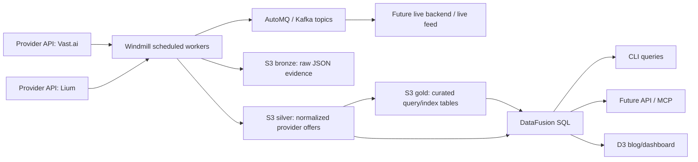

# Compute Bazaar Architecture

The platform is a GPU market-data system: provider APIs are sampled, raw evidence is retained,
offers are normalized, and curated query tables are exposed through DataFusion.



## Lake Layers

Bronze is raw evidence. It stores exact provider responses so every derived price can be audited
or replayed.

Silver is normalized provider data. The first silver table is `silver/gpu_offers`, with a common
schema across providers: provider, source offer ID, GPU model, GPU count, price, location,
availability, observation time, and raw reference.

Gold is the query layer. Gold tables are curated models for comparisons, dashboards, APIs, CLI
queries, agents, and index calculations:

- `gold.fact_gpu_listings`
- `gold.fact_price_index_values`
- `gold.fact_index_constituents`
- `gold.dim_gpu_products`
- `gold.dim_providers`
- `gold.dim_regions`

Consumers should mostly read gold. Silver remains useful for debugging, source-level inspection,
and rebuilding gold when the methodology changes.

## Current Stage

Stage 1 is live:

- Windmill pulls Vast on a schedule from inside the AWS VPC.
- Raw Vast responses are written to S3 bronze.
- Normalized offers are written to S3 silver.
- AutoMQ receives provider snapshot and normalized offer events.
- DataFusion can query the latest silver manifest and Parquet file.

Stage 1.5 is now started:

- `gpu-prices build-gold` builds the first gold tables from latest silver.
- `gpu-prices gold-index` queries `gold.fact_price_index_values`.
- `gpu-prices gold-provider-comparison` queries provider floors from `gold.fact_gpu_listings`.
- `gpu-prices export-gold-dashboard` writes public-safe JSON snapshots for static D3 sections.

## Second Provider

Lium is the second provider. It uses the same bronze and silver contracts as Vast: raw executor
responses are retained, available executors are normalized into `silver/gpu_offers`, and combined
gold tables are built with:

```sh
uv run gpu-prices build-gold --providers vast,lium
```

The Lium adapter uses `GET /api/executors` with `X-API-Key` authentication, based on the public
OpenAPI document at `https://lium.io/api/openapi.json`.

The current Lium smoke run writes S3 bronze/silver and participates in combined gold. The recurring
Kafka-producing Lium job should run from the VPC Windmill worker, the same as Vast, because the
AutoMQ endpoint is private DNS.

The first provider-comparison query shape is:

```sql
select
  gpu_model,
  provider,
  min(price_usd_gpu_hr) as floor_usd_gpu_hr,
  avg(price_usd_gpu_hr) as simple_mean_usd_gpu_hr,
  count(*) as listing_count
from gold.fact_gpu_listings
where availability_status = 'available'
group by gpu_model, provider
order by gpu_model, floor_usd_gpu_hr;
```

## Blog And D3

The personal-site essay can stay as static HTML with D3 sections embedded as progressive
enhancement. The browser should not connect directly to AutoMQ or hold Kafka credentials.

The clean public path is:

```text
gold tables -> DataFusion query/export -> public JSON snapshot -> D3 in the blog post
```

The first snapshot files are:

- `manifest.json`
- `latest-index.json`
- `provider-comparison.json`
- `listings-sample.json`

For local development, write snapshots to `data/dashboard/compute-bazaar/` and serve the repository
root with a local HTTP server. For a public static essay, write the same snapshots to an S3/CloudFront
prefix and point the page at that URL:

```sh
uv run gpu-prices export-gold-dashboard --output-root s3://YOUR_BUCKET/public/compute-bazaar
```

The browser should fetch the public HTTPS form of that prefix, not the private `s3://` URI. The
bucket or CloudFront distribution must allow public reads for those JSON objects and set CORS so
the personal site can fetch them.

Later, live widgets can use:

```text
AutoMQ -> small backend consumer -> safe SSE/WebSocket endpoint -> D3 live view
```

That lets the essay start with stable snapshots, then gain live market elements without exposing
private broker endpoints or secrets.
