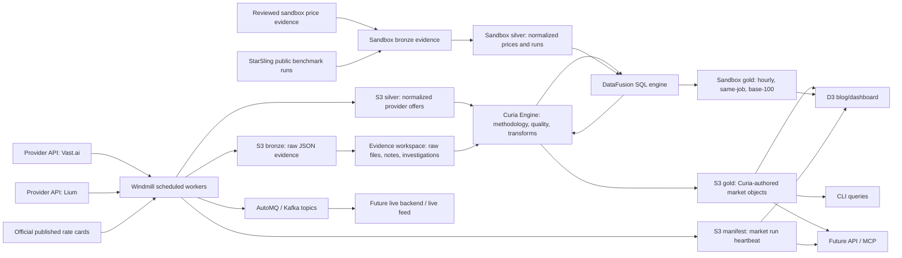

# Compute Bazaar Architecture

The platform is a GPU market-data system: provider APIs are sampled, raw evidence is retained,
offers are normalized, and Curia-authored market products are exposed through DataFusion-backed
queries, dashboard snapshots, and later API/MCP tools.



## Lake Layers

Bronze is raw evidence. It stores exact provider responses so every derived price can be audited
or replayed.

Silver is normalized provider data. The first silver table is `silver/gpu_offers`, with a common
schema across providers: provider, source offer ID, GPU model, GPU count, price, location,
availability, observation time, and raw reference.

Curia is the authoring layer. Curia decides which inputs are allowed, which methodology version
runs, which SQL or non-SQL algorithms execute, which quality rules apply, and what gets written to
Gold. DataFusion is one compute engine Curia uses for SQL over Parquet lake tables.

Gold is the product truth layer. Gold tables are Curia-authored models for comparisons, dashboards,
APIs, CLI queries, agents, and index calculations:

- `gold.fact_gpu_listings`
- `gold.fact_price_index_values`
- `gold.fact_index_constituents`
- `gold.fact_benchmark_values`
- `gold.fact_benchmark_constituents`
- `gold.dim_gpu_products`
- `gold.dim_providers`
- `gold.dim_regions`

Consumers should mostly read gold. Silver remains useful for debugging, source-level inspection,
and rebuilding gold when the methodology changes.

The rule is:

```text
Bronze can be messy.
Silver should be standardized.
Gold must be authored.
```

See [curia-engine.md](curia-engine.md) for the Curia boundary.

## Compute Index

The compute index is a first-class gold product, not just an ad hoc query result.

```text
silver/gpu_offers
  -> Curia Engine
  -> gold/fact_gpu_listings
  -> named DataFusion methodology query
  -> gold/fact_price_index_values
  -> gold/fact_price_index_constituents
```

For Stage 1, the index should stay simple and honest:

```text
Compute Bazaar Live Price Index
Indicative advertised GPU-hour benchmark, refreshed hourly
```

The table `gold.fact_price_index_values` should answer questions like:

- What is the market price for H100 right now?
- Was it based on Vast, Lium, or both?
- Is the value a floor, median, p25, or p75?
- What methodology version created it?

The table `gold.fact_price_index_constituents` keeps candidate rows behind each value:

```text
index_value_id
listing_id
provider_id
gpu_product_id
price_per_gpu_hour
included
exclusion_reason
source_run_id
raw_uri
normalization_version
methodology_version
```

Rows with `included = false` are not part of the published floor/index value. Their
`exclusion_reason` records why, such as `not_available` or `non_positive_price`.

That makes the index auditable. Every product output should be traceable back to the raw provider
evidence, the gold inputs, and the Curia methodology that produced it.

## Benchmark Products

The H100/H200/B200/B300 benchmark strip is also a Curia-authored gold product. The current v0
methodology is query-defined in DataFusion SQL:

```text
gold.fact_gpu_listings
  -> benchmark_frontier_gpu_families_v1
  -> gold.fact_benchmark_values
  -> gold.fact_benchmark_constituents
```

The materialized benchmark tables are the hourly published memory of that query. The query and input
manifests are the reproducible methodology. This is why benchmark rows carry both
`methodology_version` and `methodology_query_id`.

The operator workbench uses the same idea for inspection views: named SQL files live under
`queries/curia/`, with metadata in `queries/curia/catalog.json`. The API and CLI run those SQL files
through DataFusion rather than embedding the view logic in Python. The same workbench also exposes
read-only scratch SQL over latest gold `fact_*` and `dim_*` tables. Scratch queries are exploratory;
useful ones should be promoted into the Curia catalog before they become methodology.

## Sandbox Cost Product

The sandbox-cost benchmark applies the same layer discipline to public CPU and
memory rates plus the StarSling HPC Sandbox Benchmark:

```text
reviewed price evidence + commit-pinned public benchmark source
  -> bronze
  -> silver/sandbox_hourly_prices
  -> silver/sandbox_benchmark_runs
  -> DataFusion methodology queries
  -> gold/sandbox_hourly_price_series
  -> gold/sandbox_price_events
  -> gold/sandbox_current_rates
  -> gold/sandbox_fixed_rate
  -> gold/sandbox_same_job_cost
  -> gold/sandbox_same_job_summary
  -> gold/gpu_h100_daily_coverage
  -> gold/gpu_h100_eligible_history
  -> gold/sandbox_gpu_cpu_common_start
  -> dashboard/compute-bazaar/sandbox-cost.json
```

The fixed hourly rate uses the same eight services at every event date and
publishes the cohort median and p25-p75 range; the arithmetic mean remains a
secondary descriptive field. Same-job cost is
`runtime_seconds / 3600 * hourly_price`, using only the processor-and-memory
component. The workload summary retains all raw runs and calculates medians,
interquartile ranges, and a descriptive lower-left runtime/cost frontier.

The combined GPU/sandbox series uses hourly H100 benchmark prints only when at
least 10 providers contribute. It rebases both compatible series to 100 at the
first eligible H100 timestamp. The full retained H100 history remains in the
coverage table, including excluded low-coverage periods. This view does not
combine raw dollar levels or claim demand, transaction volume, or GPU
utilization.

The hourly Windmill heartbeat rebuilds this gold product after GPU dashboard
history is exported. A separate daily source check detects new or changed
StarSling evidence. Public provider price pages are reviewed manually because
their billing semantics are not safely interchangeable or uniformly
machine-readable.

See [sandbox-cost-benchmark.md](sandbox-cost-benchmark.md) for the complete
measurement and maintenance contract.

## Workspace / Evidence Layer

The future agent workspace is not Gold. It is where agents and operators can do messy investigation:

- inspect raw S3 evidence
- grep provider files or docs
- compare unusual listings
- write anomaly notes
- produce candidate labels

Those artifacts can become Gold only after Curia validates and promotes them into a controlled
label, signal, score, or narrative table.

## Current Stage

Stage 1 is live:

- Windmill runs direct live APIs, public cross-cloud catalogs, cloud price
  observations, and separately labeled published rate cards from inside the
  AWS VPC.
- The default source set is Vast, Lium, Spheron, Inference.sh, GridStackHub,
  Cloud GPU Prices, Thunder Compute, Vultr, Scaleway, Oracle Cloud, OVHcloud,
  Clore, Akash, RunPod, and Verda. AWS Spot and Azure retail are current price
  observations but are not proof of deployable capacity. External aggregators
  are retained for discovery and comparison but cannot vote in the benchmark.
- Optional authenticated connectors cover Prime Intellect, Shadeform,
  Sesterce, TensorDock, Hyperstack, Lambda Cloud, DigitalOcean, GPUs.io,
  JarvisLabs, and Verda availability.
- The heartbeat can also ingest official published rate cards from Runpod, Lambda, Hyperstack,
  Nebius, Crusoe, Civo, Denvr, DigitalOcean, GMI Cloud, Hyperbolic, Koyeb,
  Massed Compute, TensorDock, Verda, VESSL, and Voltage Park as clearly marked
  provider observations.
- Raw provider responses are written to S3 bronze. Lium stores a raw pagination envelope so the
  bronze layer contains page-level provider evidence, not just extracted rows.
- Normalized offers are written to S3 silver.
- AutoMQ receives provider snapshot and normalized offer events.
- Curia can use DataFusion to query the latest silver/gold manifests and Parquet files.

Stage 1.5 is now started:

- `gpu-prices build-gold` builds the first gold tables from latest silver.
- `gpu-prices gold-index` queries `gold.fact_price_index_values`.
- `gpu-prices gold-index-quality` summarizes included/excluded candidate counts.
- `gpu-prices gold-index-constituents` exposes index evidence rows.
- `gpu-prices gold-provider-comparison` queries provider floors from `gold.fact_gpu_listings`.
- `gpu-prices gold-benchmarks` queries the materialized benchmark values.
- `gpu-prices gold-benchmark-constituents` exposes benchmark evidence rows.
- `gpu-prices export-gold-dashboard` writes public-safe JSON snapshots for static D3 sections.
- `gpu-prices market-hourly` runs the complete provider-to-dashboard heartbeat and writes
  `gold/_manifests/market_runs/latest.json`.

The Windmill schedule is active. The next operational step is to watch the first few cycles for
provider/API, Kafka, S3, and data-quality behavior.

## Direct Provider Example

Lium uses the same bronze and silver contracts as Vast: raw executor
responses are retained, available executors are normalized into `silver/gpu_offers`, and combined
gold tables are built with:

```sh
uv run gpu-prices build-gold --providers vast,lium,spheron,inference_sh,gridstackhub,cloud_gpu_prices,thunder_compute,vultr,scaleway,oracle_cloud,ovhcloud,clore,akash,aws_spot,azure,runpod,verda,published_rate_cards
```

The Lium adapter uses `GET /api/executors` with `X-API-Key` authentication, based on the public
OpenAPI document at `https://lium.io/api/openapi.json`.

The current Lium Windmill path writes S3 bronze/silver, publishes Kafka events, and participates in
combined gold. Pagination is enabled by default in the Windmill script and bootstrap helper. The
recurring Kafka-producing Lium job runs from the VPC Windmill worker, the same as Vast, because the
AutoMQ endpoint is private DNS.

Aggregate catalogs keep the actual upstream seller in `provider` and the feed
used to observe it in `source_connector`. Benchmark provider floors therefore
remain seller-level. Capacity coverage first sums each seller/connector lower
bound, then keeps the maximum connector total for that seller; direct and
aggregate observations of the same inventory are not added together.

## Published Rate Cards

Live marketplace providers are not enough for a credible frontier benchmark when one provider has
thin H100/H200/B200/B300 coverage. The platform now supports provider-published rate-card
observations as a separate ingestion path. These rows are sourced from official public provider
pricing pages, written to bronze as `rate-card.json`, normalized to `silver/gpu_offers`, and then
included in combined gold builds.

Current published-rate providers:

- Runpod
- Lambda
- Hyperstack
- Nebius
- Crusoe
- Denvr
- TensorDock
- GMI Cloud
- Massed Compute
- Verda
- VESSL
- Voltage Park
- DigitalOcean
- Civo
- Koyeb
- Hyperbolic

These rows are not live inventory. Each keeps a source URL, source-check time,
price basis, and access mode. Current hourly and request-based advertised rates
can enter the benchmark; future and reserved rates remain queryable evidence
but are excluded. Procurement and execution still need live provider APIs.

The frontier benchmark first selects one eligible floor per provider and GPU
family, then publishes the median of those provider floors. This prevents a
marketplace with many rows from receiving accidental extra weight. See
`docs/benchmark-methodology.md` for the complete contract.

The first provider-comparison query shape is:

```sql
select
  gpu_model,
  provider,
  min(price_usd_gpu_hr) as floor_usd_gpu_hr,
  avg(price_usd_gpu_hr) as simple_mean_usd_gpu_hr,
  count(*) as listing_count
from gold.fact_gpu_listings
where availability_status in ('available', 'published_rate')
group by gpu_model, provider
order by gpu_model, floor_usd_gpu_hr;
```

## Blog And D3

The personal-site essay can stay as static HTML with D3 sections embedded as progressive
enhancement. The browser should not connect directly to AutoMQ or hold Kafka credentials.

The clean public path is:

```text
Curia-authored gold tables -> public JSON snapshot -> D3 in the blog post
```

The first snapshot files are:

- `manifest.json`
- `market-run.json`
- `market-history.json`
- `latest-index.json`
- `index-quality.json`
- `index-constituents.json`
- `provider-comparison.json`
- `listings-sample.json`

For local development, write snapshots to `data/dashboard/compute-bazaar/` and serve the repository
root with a local HTTP server. For a public static essay, write the same snapshots to an S3/CloudFront
prefix and point the page at that URL:

```sh
uv run gpu-prices export-gold-dashboard --output-root s3://YOUR_BUCKET/public/compute-bazaar
```

The browser should fetch the public HTTPS form of that prefix, not the private `s3://` URI. The
bucket or CloudFront distribution must allow public reads for those JSON objects and set CORS so
the personal site can fetch them.

Later, live widgets can use:

```text
AutoMQ -> small backend consumer -> safe SSE/WebSocket endpoint -> D3 live view
```

That lets the essay start with stable snapshots, then gain live market elements without exposing
private broker endpoints or secrets.
