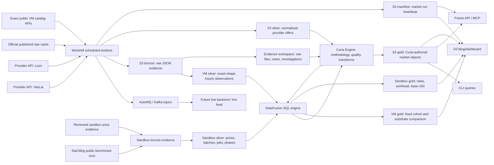

# Compute Bazaar Architecture

The platform is a GPU market-data system: provider APIs are sampled, raw evidence is retained,
offers are normalized, and Curia-authored market products are exposed through DataFusion-backed
queries, dashboard snapshots, and later API/MCP tools.


```mermaid
flowchart LR
  Vast["Provider API: Vast.ai"] --> Windmill["Windmill scheduled workers"]
  Lium["Provider API: Lium"] --> Windmill
  Rates["Official published rate cards"] --> Windmill
  VMCatalogs["Exact public VM catalog APIs"] --> Windmill
  SandboxRates["Reviewed sandbox price evidence"] --> SandboxBronze["Sandbox bronze evidence"]
  StarSling["StarSling public benchmark runs"] --> SandboxBronze

  Windmill --> AutoMQ["AutoMQ / Kafka topics"]
  Windmill --> Bronze["S3 bronze: raw JSON evidence"]
  Windmill --> Silver["S3 silver: normalized provider offers"]
  Windmill --> MarketRun["S3 manifest: market run heartbeat"]

  Silver --> Curia["Curia Engine: methodology, quality, transforms"]
  Curia --> DataFusion["DataFusion SQL engine"]
  DataFusion --> Curia
  Curia --> Gold["S3 gold: Curia-authored market objects"]
  Bronze --> VMSilver["VM silver: exact-shape hourly observations"]
  VMSilver --> DataFusion
  DataFusion --> VMGold["VM gold: fixed cohort and substrate comparison"]
  SandboxBronze --> SandboxSilver["Sandbox silver: prices, batches, jobs, phases"]
  SandboxSilver --> DataFusion
  DataFusion --> SandboxGold["Sandbox gold: rates, workload, base-100"]
  Bronze --> Workspace["Evidence workspace: raw files, notes, investigations"]
  Workspace --> Curia

  Gold --> CLI["CLI queries"]
  Gold --> API["Future API / MCP"]
  Gold --> Dashboard["D3 blog/dashboard"]
  SandboxGold --> Dashboard
  VMGold --> Dashboard
  MarketRun --> Dashboard
  MarketRun --> API
  AutoMQ --> Live["Future live backend / live feed"]
```

## Lake Layers

Bronze is raw evidence. It stores exact provider responses so every derived price can be audited
or replayed.

Silver is normalized provider data. The first silver table is `silver/gpu_offers`, with a common
schema across providers: provider, source offer ID, GPU model, GPU count, price, location,
availability, observation time, and raw reference.

Curia is the authoring layer. Curia decides which inputs are allowed, which methodology version
runs, which SQL or non-SQL algorithms execute, which quality rules apply, and what gets written to
Gold. DataFusion is one compute engine Curia uses for SQL over Parquet lake tables.

Gold is the product truth layer. Gold tables are Curia-authored models for comparisons, dashboards,
APIs, CLI queries, agents, and index calculations:

- `gold.fact_gpu_listings`
- `gold.fact_price_index_values`
- `gold.fact_index_constituents`
- `gold.fact_benchmark_values`
- `gold.fact_benchmark_constituents`
- `gold.fact_prime_frontier_offer_history`
- `gold.fact_prime_frontier_offer_events`
- `gold.fact_prime_frontier_offer_reference_history`
- `gold.fact_prime_frontier_offer_ladder`
- `gold.dim_gpu_products`
- `gold.dim_providers`
- `gold.dim_regions`

Consumers should mostly read gold. Silver remains useful for debugging, source-level inspection,
and rebuilding gold when the methodology changes.

The rule is:

```text
Bronze can be messy.
Silver should be standardized.
Gold must be authored.
```

See [curia-engine.md](curia-engine.md) for the Curia boundary.

## Compute Index

The compute index is a first-class gold product, not just an ad hoc query result.

```text
silver/gpu_offers
  -> Curia Engine
  -> gold/fact_gpu_listings
  -> named DataFusion methodology query
  -> gold/fact_price_index_values
  -> gold/fact_price_index_constituents
```

For Stage 1, the index should stay simple and honest:

```text
Compute Bazaar Live Price Index
Indicative advertised GPU-hour benchmark, refreshed hourly
```

The table `gold.fact_price_index_values` should answer questions like:

- What is the market price for H100 right now?
- Was it based on Vast, Lium, or both?
- Is the value a floor, median, p25, or p75?
- What methodology version created it?

The table `gold.fact_price_index_constituents` keeps candidate rows behind each value:

```text
index_value_id
listing_id
provider_id
gpu_product_id
price_per_gpu_hour
included
exclusion_reason
source_run_id
raw_uri
normalization_version
methodology_version
```

Rows with `included = false` are not part of the published floor/index value. Their
`exclusion_reason` records why, such as `not_available` or `non_positive_price`.

That makes the index auditable. Every product output should be traceable back to the raw provider
evidence, the gold inputs, and the Curia methodology that produced it.

## Benchmark Products

The H100/H200/B200/B300 benchmark strip is also a Curia-authored gold product. The current v0
methodology is query-defined in DataFusion SQL:

```text
gold.fact_gpu_listings
  -> benchmark_frontier_gpu_families_v1
  -> gold.fact_benchmark_values
  -> gold.fact_benchmark_constituents
```

The materialized benchmark tables are the hourly published memory of that query. The query and input
manifests are the reproducible methodology. This is why benchmark rows carry both
`methodology_version` and `methodology_query_id`.

The operator workbench uses the same idea for inspection views: named SQL files
live under `queries/curia/`, with metadata in `queries/curia/catalog.json`. The
API and CLI run those SQL files through DataFusion rather than embedding the
view logic in Python. The workbench composes the latest GPU and sandbox/VM
manifests, so one catalog can inspect all maintained gold products while
keeping each component manifest and lineage chain explicit. Scratch SQL is
read-only and can access only tables declared by those manifests. Useful
queries should be promoted into the Curia catalog before they become stable
inspection views or methodology.

### Prime Frontier Offer Market

Prime's availability API is also used for one intentionally narrow market
microstructure view:

```text
Prime immutable API snapshots
  -> silver Prime configurations
  -> cumulative H100/H200/B200/B300 offer history
  -> observable lifecycle events
  -> provider-balanced reference history
  -> $0.25 shelf centered on the wider benchmark
  -> public-safe JSON / D3 card / Curia SQL
```

Each family reference is the median of one lowest eligible base rate per
upstream provider. The current shelf also carries the matching Compute Bazaar
benchmark so Prime's requestable configurations can be read relative to the
broader market. The shelf groups configurations, not physical GPUs. The event
classifier records appearance, disappearance, stock-label changes, and
repricing, but it never invents fills or cancellations. This keeps the
high-frequency market view useful without promoting catalogue presence into
transaction evidence.

## Sandbox Cost Product

The sandbox-cost benchmark applies the same layer discipline to exact-shape
public VM offers, reviewed managed-sandbox CPU and memory rates, and the
StarSling HPC Sandbox Benchmark:

```text
exact public VM APIs + reviewed sandbox price evidence
  + commit-pinned public benchmark source
  -> bronze
  -> silver/vm_capacity_offer_history
  -> silver/vm_capacity_current
  -> silver/sandbox_hourly_prices
  -> silver/sandbox_benchmark_batches
  -> silver/sandbox_benchmark_replicates
  -> silver/sandbox_benchmark_phases
  -> silver/sandbox_benchmark_run_metadata
  -> DataFusion methodology queries
  -> gold/vm_capacity_current
  -> gold/vm_capacity_fixed_rate
  -> gold/vm_sandbox_current_comparison
  -> gold/sandbox_hourly_price_series
  -> gold/sandbox_price_events
  -> gold/sandbox_current_rates
  -> gold/sandbox_fixed_rate
  -> gold/sandbox_workload_batch_history
  -> gold/sandbox_workload_latest_replicates
  -> gold/sandbox_workload_latest_phases
  -> gold/sandbox_workload_phase_summary
  -> gold/sandbox_workload_service_summary
  -> gold/sandbox_workload_run_history
  -> gold/gpu_h100_daily_coverage
  -> gold/gpu_h100_eligible_history
  -> gold/sandbox_gpu_cpu_common_start
  -> dashboard/compute-bazaar/sandbox-cost.json
```

The VM product uses a fixed seven-vendor cohort of exact four-vCPU, 8 GiB
on-demand offers. Each hourly check retains raw API responses and checksums,
and silver appends one normalized observation per successful source even when
the price is unchanged. Gold publishes one median/p25-p75/min/max point for
every complete seven-vendor timestamp, the same fields rebased to the first
complete VM median, the current cross-section, and a descriptive
VM-to-sandbox rate ratio. The earlier four-vendor cohort remains queryable as
v1 audit data. Akash request estimates are retained as marketplace indications
and excluded from the vendor median. Bundled storage and CPU semantics remain
explicit; the ratio is not a margin or like-for-like product decomposition.

The fixed hourly rate uses the same eight services at every event date and
publishes the cohort median and p25-p75 range; the arithmetic mean remains a
secondary descriptive field. The latest workload product reconstructs 72
complete individual jobs from 720 phase samples with aligned upstream replicate
indices. Its cost field is
`measured_phase_seconds / 3600 * hourly_price`, using only the public
processor-and-memory component. It is a marginal rate-card estimate, not a
provider bill.

The historical workload table retains 62 provider-batch means from eleven source
runs. Those batches cross ten harness revisions, so history is stratified by
methodology rather than rendered as one homogeneous performance series.
Lifecycle latency, queueing, reliability, and concurrency remain separate
future measurements.

DataFusion also groups the retained provider-batch rows by source run into
`sandbox_workload_run_history`. Each row carries service count, fixed-cohort
completeness, median/p25/p75 runtime, median/p25/p75 estimated
processor-and-memory cost, source run ID, source commit, and methodology ID.
All eleven source runs remain present, including repeated intraday runs. The
article's headline history uses only the seven runs containing all six fixed
services; it does not rewrite incomplete runs or average them by day.

The combined GPU/sandbox series uses hourly H100 benchmark prints only when at
least 10 providers contribute. It rebases both compatible series to 100 at the
first eligible H100 timestamp. The independently based VM/VPS series joins the
frontend comparison from its first complete seven-vendor observation. All
three metrics are built in DataFusion before publication. The full retained
H100 history remains in the coverage table, including excluded low-coverage
periods. This view does not combine raw dollar levels or claim demand or
transaction volume.

The market-state product separately publishes source-reported active or rented
capacity where numerator and denominator exist. Akash CPU, GPU, memory, and
storage units, Clore public servers, and Prime configurations remain distinct
series. The article pairs each selected share with its source numerator,
denominator, unit, and scope; those counts are capacity observations, not
transaction volume, and no statistical band is inferred.

The article market pulse composes existing gold products without deriving
market statistics in JavaScript. Its six panes are:

```text
H100 observed benchmark | Akash available GPU share
seven-vendor VM median  | Akash available CPU share
StarSling job-cost median | StarSling measured-runtime median
```

The first four panes advance with the hourly market run. The StarSling panes
advance only after the daily public-source poll publishes another compatible
content-addressed generation. A 1D view may retain the latest StarSling point
for context, but it labels the point's actual source time and says when it lies
outside the selected live window.

The hourly Windmill heartbeat checks the exact VM APIs and rebuilds this gold
product after GPU dashboard history is exported. A separate daily source check
detects VM source/schema drift and new or changed StarSling evidence. Managed
sandbox price pages are reviewed manually because their billing semantics are
not safely interchangeable or uniformly machine-readable.

See [sandbox-cost-benchmark.md](sandbox-cost-benchmark.md) for the complete
measurement and maintenance contract.

## Workspace / Evidence Layer

The future agent workspace is not Gold. It is where agents and operators can do messy investigation:

- inspect raw S3 evidence
- grep provider files or docs
- compare unusual listings
- write anomaly notes
- produce candidate labels

Those artifacts can become Gold only after Curia validates and promotes them into a controlled
label, signal, score, or narrative table.

## Current Stage

Stage 1 is live:

- Windmill runs direct live APIs, public cross-cloud catalogs, cloud price
  observations, and separately labeled published rate cards from inside the
  AWS VPC.
- The default source set is Vast, Lium, Spheron, Inference.sh, GridStackHub,
  Cloud GPU Prices, Thunder Compute, Vultr, Scaleway, Oracle Cloud, OVHcloud,
  Akash, RunPod, and Verda. AWS Spot and Azure retail are current price
  observations but are not proof of deployable capacity. External aggregators
  are retained for discovery and comparison but cannot vote in the benchmark.
- Optional authenticated connectors cover Clore, Prime Intellect, Shadeform,
  Sesterce, TensorDock, Hyperstack, Lambda Cloud, DigitalOcean, GPUs.io,
  JarvisLabs, and Verda availability.
- The heartbeat can also ingest official published rate cards from Runpod, Lambda, Hyperstack,
  Nebius, Crusoe, Civo, Denvr, DigitalOcean, GMI Cloud, Hyperbolic, Koyeb,
  Massed Compute, TensorDock, Verda, VESSL, and Voltage Park as clearly marked
  provider observations.
- Raw provider responses are written to S3 bronze. Lium stores a raw pagination envelope so the
  bronze layer contains page-level provider evidence, not just extracted rows.
- Normalized offers are written to S3 silver.
- Source-defined capacity observations are written to
  `silver/compute_market_state`. Rental occupancy is admitted only when a
  source supplies both the rented numerator and matching total denominator.
- AutoMQ receives provider snapshot and normalized offer events.
- AutoMQ also receives `gpu.market_state_observation.v1` events.
- Curia can use DataFusion to query the latest silver/gold manifests and Parquet files.

Stage 1.5 is operating:

- `gpu-prices build-gold` builds the first gold tables from latest silver.
- `gpu-prices gold-index` queries `gold.fact_price_index_values`.
- `gpu-prices gold-index-quality` summarizes included/excluded candidate counts.
- `gpu-prices gold-index-constituents` exposes index evidence rows.
- `gpu-prices gold-provider-comparison` queries provider floors from `gold.fact_gpu_listings`.
- `gpu-prices gold-benchmarks` queries the materialized benchmark values.
- `gpu-prices gold-benchmark-constituents` exposes benchmark evidence rows.
- `operator-query compute_market_state --version v1` queries current
  occupancy, availability pressure, and offer depth through DataFusion.
- `operator-query compute_price_cross_section --version v0` inspects current
  GPU benchmark, exact-shape VM, and managed-sandbox prices with their
  different units and shapes preserved.
- `operator-query sandbox_workload_costs --version v0` inspects measured
  runtime and estimated processor-and-memory cost from workload gold.
- `gpu-prices export-gold-dashboard` writes public-safe JSON snapshots for static D3 sections.
- `gpu-prices market-hourly` runs the complete provider-to-dashboard heartbeat and writes
  `gold/_manifests/market_runs/latest.json`.

The Windmill schedule is active. GPU and sandbox gold manifests point to
immutable run/build generations, and the VM collectors serialize cumulative
history updates with conditional S3 leases. Operational status now describes
whether ingestion and publication worked; unknown GPU aliases are retained
separately as normalization/data-quality debt. An hourly external freshness
check watches the public snapshot and latest complete VM observation.

The operator displays the latest market-run health separately from product
availability. A partial upstream failure therefore remains visible even when
Curia successfully writes a coherent gold generation from the other sources.
The public article stays a smaller narrative projection; it is not the place
to expose every table or private lake reference.

The capacity-state path has two gold tables:

- `fact_compute_market_state` is the latest cross-section.
- `fact_compute_market_state_history` cumulatively retains hourly observations
  by stable observation ID.

Akash's network rows divide active capacity by total capacity from the same
online providers for CPU (millicores), GPU units, memory bytes, and storage
bytes. Official Akash operations documentation describes active inventory as
resources consumed by deployments. Clore's row is server weighted and
on-demand only: public servers with `rented=true` divided by public servers
with that flag. Prime divides configurations carrying an available stock
status by all configurations returned for the same upstream provider and GPU
product. These rows can share a percentage scale but are not pooled because
their units and market scopes differ. Prime Intellect keeps the upstream seller
in `provider`; when the same provider/model is available from a direct
connector, the aggregate observation stays auditable but is marked ineligible
for aggregation.

Clore requires `CLORE_API_KEY`. If that key is absent, it is omitted from the
hourly provider scope; previous source observations remain in historical gold.

The full model-level state stays in these gold tables and remains queryable
through DataFusion. The public `market-state.json` export contains the current
occupancy and availability cross-section, but limits public history to
aggregate CPU, GPU, memory, and storage rows. That keeps the static article
payload bounded without making the publication file the system of record.

## Direct Provider Example

Lium uses the same bronze and silver contracts as Vast: raw executor
responses are retained, available executors are normalized into `silver/gpu_offers`, and combined
gold tables are built with:

```sh
uv run gpu-prices build-gold --providers vast,lium,spheron,inference_sh,gridstackhub,cloud_gpu_prices,thunder_compute,vultr,scaleway,oracle_cloud,ovhcloud,clore,akash,aws_spot,azure,runpod,verda,published_rate_cards
```

The Lium adapter uses `GET /api/executors` with `X-API-Key` authentication, based on the public
OpenAPI document at `https://lium.io/api/openapi.json`.

The current Lium Windmill path writes S3 bronze/silver, publishes Kafka events, and participates in
combined gold. Pagination is enabled by default in the Windmill script and bootstrap helper. The
recurring Kafka-producing Lium job runs from the VPC Windmill worker, the same as Vast, because the
AutoMQ endpoint is private DNS.

Aggregate catalogs keep the actual upstream seller in `provider` and the feed
used to observe it in `source_connector`. Benchmark provider floors therefore
remain seller-level. Capacity coverage first sums each seller/connector lower
bound, then keeps the maximum connector total for that seller; direct and
aggregate observations of the same inventory are not added together.

## Published Rate Cards

Live marketplace providers are not enough for a credible frontier benchmark when one provider has
thin H100/H200/B200/B300 coverage. The platform now supports provider-published rate-card
observations as a separate ingestion path. These rows are sourced from official public provider
pricing pages, written to bronze as `rate-card.json`, normalized to `silver/gpu_offers`, and then
included in combined gold builds.

Current published-rate providers:

- Runpod
- Lambda
- Hyperstack
- Nebius
- Crusoe
- Denvr
- TensorDock
- GMI Cloud
- Massed Compute
- Verda
- VESSL
- Voltage Park
- DigitalOcean
- Civo
- Koyeb
- Hyperbolic

These rows are not live inventory. Each keeps a source URL, source-check time,
price basis, and access mode. Current hourly and request-based advertised rates
can enter the benchmark; future and reserved rates remain queryable evidence
but are excluded. Procurement and execution still need live provider APIs.

The frontier benchmark first selects one eligible floor per provider and GPU
family, then publishes the median of those provider floors. This prevents a
marketplace with many rows from receiving accidental extra weight. See
`docs/benchmark-methodology.md` for the complete contract.

The first provider-comparison query shape is:

```sql
select
  gpu_model,
  provider,
  min(price_usd_gpu_hr) as floor_usd_gpu_hr,
  avg(price_usd_gpu_hr) as simple_mean_usd_gpu_hr,
  count(*) as listing_count
from gold.fact_gpu_listings
where availability_status in ('available', 'published_rate')
group by gpu_model, provider
order by gpu_model, floor_usd_gpu_hr;
```

## Blog And D3

The personal-site essay can stay as static HTML with D3 sections embedded as progressive
enhancement. The browser should not connect directly to AutoMQ or hold Kafka credentials.

The clean public path is:

```text
Curia-authored gold tables -> public JSON snapshot -> D3 in the blog post
```

The first snapshot files are:

- `manifest.json`
- `market-run.json`
- `market-history.json`
- `latest-index.json`
- `index-quality.json`
- `index-constituents.json`
- `provider-comparison.json`
- `listings-sample.json`

For local development, write snapshots to `data/dashboard/compute-bazaar/` and serve the repository
root with a local HTTP server. For a public static essay, write the same snapshots to an S3/CloudFront
prefix and point the page at that URL:

```sh
uv run gpu-prices export-gold-dashboard --output-root s3://YOUR_BUCKET/public/compute-bazaar
```

The browser should fetch the public HTTPS form of that prefix, not the private `s3://` URI. The
bucket or CloudFront distribution must allow public reads for those JSON objects and set CORS so
the personal site can fetch them.

Later, live widgets can use:

```text
AutoMQ -> small backend consumer -> safe SSE/WebSocket endpoint -> D3 live view
```

That lets the essay start with stable snapshots, then gain live market elements without exposing
private broker endpoints or secrets.
