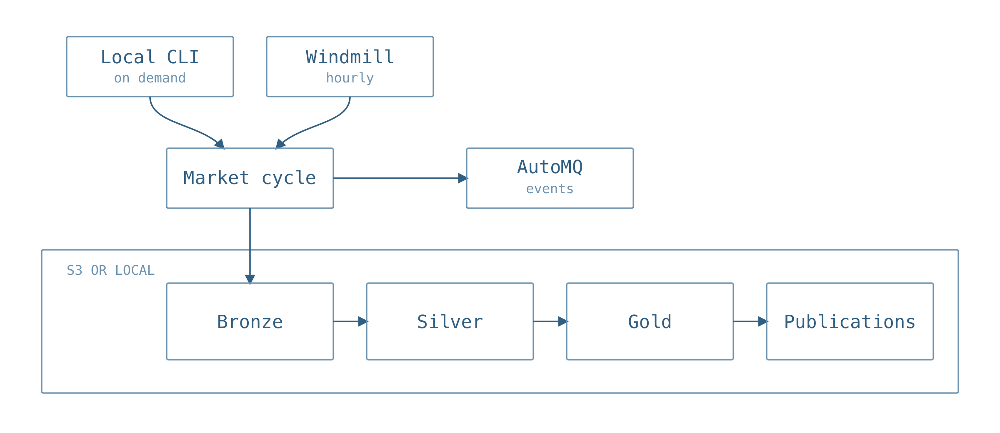

# Pipeline

The pipeline gathers market data, normalizes offers, builds models, and
publishes. Run the same cycle locally or hourly with Windmill.

<p align="center">
  <picture>
    <source media="(prefers-color-scheme: dark)" srcset="../../assets/compute-bazaar-pipeline-dark.png">
    
  </picture>
</p>

Run locally:

```bash
uv sync --extra market
compute-bazaar market refresh
```

Windmill runs two jobs:

- `market_hourly.py` builds and publishes the market lake.
- `sandbox_benchmark_weekly.py` imports public StarSling results.

## Runtime

`self-host/` contains a Docker Compose runtime with Postgres, Windmill, its
worker, and Caddy. On the private host, place those files in `/opt/windmill`,
create `.env` from `.env.example`, and keep it readable only by its owner.

Start the database, server, and local proxy:

```bash
cd /opt/windmill
sudo docker compose up -d db windmill_server caddy
```

Deploy the worker from one committed revision:

```bash
uv run python infra/windmill/deploy_worker.py \
  --host ec2-user@RUNTIME_HOST \
  --revision HEAD
```

The helper archives that revision, builds it on the host, replaces only the
worker, and verifies the running commit. A Git push does not deploy the worker.

## Access

Windmill and AutoMQ stay bound to localhost on the private runtime. Update the
laptop SSH rule and open a tunnel:

```bash
uv run python infra/aws/refresh_runtime_access.py \
  --profile YOUR_AWS_PROFILE \
  --security-group-id YOUR_SECURITY_GROUP_ID \
  --prune-stale

ssh -i .secrets/compute-bazaar-automq-runtime.pem \
  -o ExitOnForwardFailure=yes \
  -L 8080:127.0.0.1:8080 \
  -L 18081:127.0.0.1:8081 \
  ec2-user@RUNTIME_HOST
```

- AutoMQ: `http://127.0.0.1:8080`
- Windmill: `http://127.0.0.1:18081`

Do not expose runtime ports `8080` or `8081` through the public security group.

## Configuration

The bootstrap scripts read these values from the environment and store them as
Windmill variables or secrets:

```text
AWS_REGION
COMPUTE_BAZAAR_RAW_ROOT
COMPUTE_BAZAAR_LAKE_ROOT
COMPUTE_BAZAAR_DASHBOARD_OUTPUT_ROOT
COMPUTE_BAZAAR_PUBLIC_BASE_URL
COMPUTE_BAZAAR_KAFKA_BOOTSTRAP_SERVERS
COMPUTE_BAZAAR_KAFKA_SECURITY_PROTOCOL
COMPUTE_BAZAAR_KAFKA_SASL_MECHANISM
COMPUTE_BAZAAR_KAFKA_USERNAME
COMPUTE_BAZAAR_KAFKA_PASSWORD
provider API keys
```

Use the EC2 IAM role for AWS access and Windmill secrets for credentials. Do
not put credentials in the worker image.

## Schedules

Create or update the schedules through the private tunnel:

```bash
export WINDMILL_TOKEN=...
export WINDMILL_WORKSPACE=compute-bazaar

uv run python infra/windmill/bootstrap_market_schedule.py
uv run python infra/windmill/bootstrap_sandbox_benchmark_weekly_schedule.py
```

The market cycle defaults to hourly:

```text
0 0 * * * *
```

StarSling defaults to a weekly poll. It reads committed public results and
keeps their measured dates; it does not create observations between runs.

Run one market cycle immediately:

```bash
uv run python infra/windmill/bootstrap_market_schedule.py \
  --run-now \
  --wait \
  --run-id market-manual-YYYYMMDD
```

Verify the market manifest, cards, and published lake:

```bash
uv run python infra/aws/check_public_market.py \
  --base-url "$COMPUTE_BAZAAR_PUBLIC_BASE_URL" \
  --require-renderer-revision "$(git rev-parse HEAD)"
```

The [public lake](../aws/public-feed/README.md) documents the CloudFront layer
used to serve these outputs.

## Worker safety

The current Compose worker uses `privileged: true` and `DISABLE_NSJAIL=true`.
Keep it on a private, single-tenant host. A multi-tenant deployment should use
Windmill's sandboxed worker path instead.
